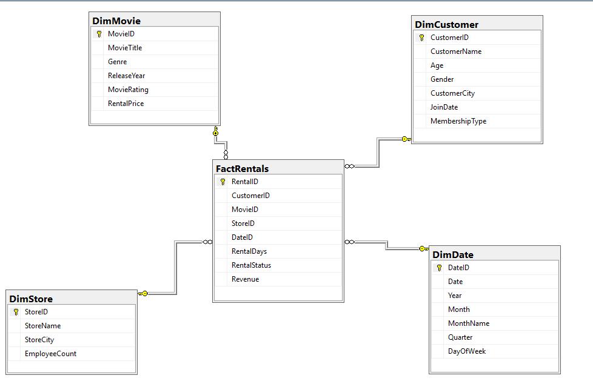

# 🎬 Movie Rental Data Warehouse

## 📌 Project Overview

This project demonstrates the design and analysis of a movie rental data warehouse using SQL. It follows a Star Schema design and includes analytical queries to extract meaningful business insights from rental data.

---

## 🛠️ Technologies Used

- SQL Server
- Star Schema
- Fact & Dimension Tables
- SQL Queries

---

## 📂 Database Structure

### Fact Table
- FactRentals

### Dimension Tables
- DimCustomer
- DimMovie
- DimStore
- DimDate

---

## 📊 SQL Concepts Used

- SELECT
- WHERE
- ORDER BY
- GROUP BY
- HAVING
- INNER JOIN
- Aggregate Functions
- Common Table Expressions (CTEs)
- Views
- Stored Procedures

---

## 📷 Database Schema

---

## 💡 Skills Demonstrated

- Database Design
- Star Schema Modeling
- SQL Query Writing
- Data Analysis
- Data Aggregation
- Business Reporting

---

## 📁 Project Files

- 3oxlas0g..sql
- DimCustomer.csv
- DimDate.csv
- DimMovie.csv
- DimStore.csv
- FactRentals.csv

---

## 👤 Author

Mohamed Ayman

LinkedIn: www.linkedin.com/in/mohamed-ayman-a169ba253
